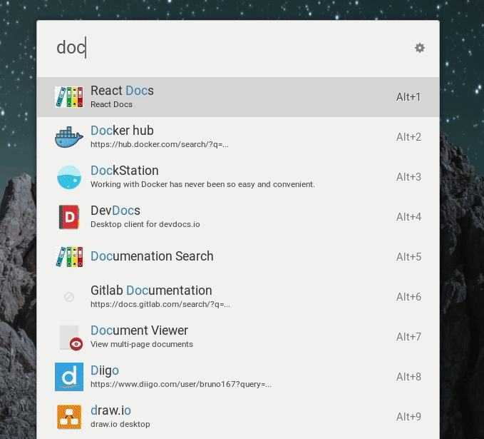

# ulauncher-docsearch

> Full text search on Documentation sites, powered by [Algolia](https://www.algolia.com/) Docsearch.

[](https://ext.ulauncher.io/-/github-brpaz-ulauncher-docsearch)


## Motivation

Searching documentation is a constant need but not an easy task. Switch contexts between your code editor to the browser, remember the documentation site url and then find what you need. Many times, I kwew exactly what I want to find and that I have seen before, but simple cant find it again.

This extension, aims to make documentation search less painfull, allowing you to a full text search on popular documentation sites directly from directly from ulauncher.

## Features

This extension allows to easily search on popular documentation websites, that implements [Algolia DocSearch](https://community.algolia.com/docsearch/).

The following documentation sites are included by default in this extension:

-   Apollo GraphQL
-   Astro
-   Babel
-   Cypress
-   Directus CMS
-   Echo
-   Eslint
-   FluxCD
-   Gatsby
-   GitLab
-   GORM
-   Grafana
-   GraphQL
-   Gridsome
-   Helm
-   Jest
-   Laravel
-   Netlify
-   NuxtJS
-   Parcel
-   Prettier
-   Prisma
-   Prometheus
-   React
-   Scala
-   Strapi
-   Supabase
-   Symfony
-   Tailwind
-   Terraform
-   Typescript
-   Vercel
-   Vite
-   VitePress
-   Vue
-   Vuepress
-   Vuetify
-   Vuex
-   Vue-Router
-   Webpack
-   Web.dev


## Requirements

- Ulauncher V5
- Python packages:
  - ```pip install --user "algoliasearch>=2.0,<3.0"```

## Install

Open ulauncher preferences window -> extensions -> add extension and paste the following url:

```
https://github.com/brpaz/ulauncher-docsearch
```


## Usage




Open Ulauncher and type ```docs```. A list of available documentation sites will appear. Select one and type your search keyword to search on that website.

Optionally some documentation also supports a custom keyword, to trigger it directly without having to type ```docs``` before.

For example, for Vue documentation, you can just type ```vuedocs <query>```.

You can see the supported keywords in [manifest.json](manifest.json) file.


## Development

```
git clone https://github.com/brpaz/ulauncher-docsearch
make link
```

The `make link` command will symlink the cloned repo into the appropriate location on the ulauncher extensions folder.

To see your changes, stop ulauncher and run it from the command line with: `ulauncher -v`.

## Contributing

All contributions are welcome.

If you want to add new documentation, you can either do a PR so other users can benefit with it or adding it locally.

Please see the following guide to know how:

* [Add new documentation](docs/add-new-doc.md)


## 💛 Support the project

If this project was useful to you in some form, I would be glad to have your support.  It will help to keep the project alive and to have more time to work on Open Source.

The sinplest form of support is to give a ⭐️ to this repo.

You can also contribute with [GitHub Sponsors](https://github.com/sponsors/brpaz).

[](https://github.com/sponsors/brpaz)


Or if you prefer a one time donation to the project, you can simple:

<a href="https://www.buymeacoffee.com/Z1Bu6asGV" target="_blank"></a>

## Author

👤 **Bruno Paz**

* Website: [brunopaz.dev](https://brunopaz.dev)
* Github: [@brpaz](https://github.com/brpaz)
* Twitter: [@brunopaz88](https://twitter.com/brunopaz88)
## Credits

This project would never be possible without the awesome folks at [Algolia](https://www.algolia.com/) who build this search engine and all the websites that implemented it.

## License

Copywright [Bruno Paz](https://github.com/brpaz)

This project is [MIT](LLICENSE) Licensed.

<a href="https://www.flaticon.com/free-icons/guideline" title="guideline icons">Guideline icons created by Andrean Prabowo - Flaticon</a>
