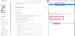

## Add new Documentation

It´s pretty easy to add new documentation to this extension. 

The only requirement is that the Documentation site must use [Algolia DocSearch](https://community.algolia.com/docsearch/) as their search engine. You can check all availalbe sites [here](https://github.com/algolia/docsearch-configs).

The first step is to add an entry to the docsets json file.

The "algolia_index", "algolia_application_id" and "algolia_api_key" properties can be found by inspecting the search request of the original site. For example for VueJS documentation, do a search and look for the following in the "Netowrk tab" of your Browser



You also need to add an icon to the **icons/docs** folder, whose path should match the one configured in "docset.json" file.

## Add local documentation

Besides the default `docsets.json`, this extension also looks for the file `~/.config/ulauncher/ext_preferences/docsearch/docsets.json`. You can use this method if you dont want to share your documentation.

The file is exactly the same structure as the default.

It doesnt exist by default, you have to create it manually.

The icon can be placed anywhere in ```~/.config/ulauncher/ext_preferences/docsearch``` directory. You must add the relative path from this directory to your `docsets.json` file.
